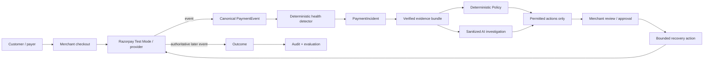

<div align="center">

# ReRoute Sentinel

### AI payment-incident response for revenue recovery

**Detect degradation. Diagnose the cause. Constrain the response. Recover safely. Prove the outcome.**

ReRoute Sentinel watches payment health, detects meaningful degradation, assembles deterministic evidence, uses AI only for bounded advisory analysis, applies deterministic Policy, requires human approval for consequential actions, and counts revenue as recovered only when provider evidence proves it.

<a href="https://revnue-agent.vercel.app/">
  
</a>

### [Open the live product →](https://revnue-agent.vercel.app/)

[Watch the MP4](assets/reroute-sentinel-intro.mp4) · [How it works](#how-it-works) · [Why AI](#why-ai-is-used) · [Quickstart](#quickstart)

[](https://github.com/aditya-zig/Revnue-Agent/actions/workflows/ci.yml)
[](LICENSE)


</div>

---

## The 30-second explanation

A merchant should not have to stare at failed-payment dashboards all day.

Payments happen normally. Sentinel watches them. If a meaningful cohort suddenly degrades—for example, UPI success falls sharply—Sentinel creates a `PaymentIncident`, measures the change against the merchant baseline, estimates the revenue exposed, and investigates before interrupting the merchant.

The merchant sees one actionable incident:

> **UPI payment degradation detected**  
> Normal success rate → current success rate  
> Affected payments  
> **₹X estimated at risk**  
> Verified facts  
> AI analysis — advisory  
> Policy-safe recommended action

Then the control loop is:

```text
Payment traffic
    ↓
Deterministic incident detection
    ↓
Verified evidence bundle
    ↓
AI advisory analysis
    ↓
Deterministic Policy
    ↓
Permitted actions only
    ↓
Merchant approval
    ↓
Bounded recovery action
    ↓
Provider evidence
    ↓
Outcome: RECOVERED / FAILED / STOPPED
```

**The key rule:** AI may explain and rank permitted actions. It cannot invent payment facts, bypass Policy, approve itself, or declare money recovered.

---

## Try the product

Open **[revnue-agent.vercel.app](https://revnue-agent.vercel.app/)** and choose **Try it for yourself →**.

The public experience is the product itself, not a separate judge dashboard.

The guided flow is designed around this sequence:

1. Start from healthy merchant payment activity.
2. Run a clearly labelled simulated merchant-day replay.
3. Watch a real backend incident detector identify degradation.
4. Review deterministic facts and estimated exposure.
5. Inspect **AI ANALYSIS — ADVISORY** separately from verified facts.
6. See deterministic Policy remove unsafe actions before ranking.
7. Approve one exact permitted recovery action.
8. Create the Razorpay Test Mode recovery action.
9. Keep **Actual recovered = ₹0** until authoritative provider evidence exists.
10. Inspect the audit/evaluation surfaces for how the result was produced.

The product keeps **SIMULATED**, **ESTIMATED**, **AI ADVISORY**, **TEST MODE**, and **PROVIDER VERIFIED** claims separate.

---

## Why this product exists

Payment infrastructure already solves transaction processing, routing, billing and retry mechanics. Sentinel focuses on a different unit of work: the **incident across a population of transactions**.

The operational question is:

> **Something important has started going wrong across payment traffic. Which segment is broken? How much revenue is exposed? What evidence explains it? What response is safe? Which permitted action is best? Did the intervention actually restore revenue?**

Sentinel connects that into one auditable loop:

**detect → diagnose → constrain → recover → prove**

### Core objects

| Object | Purpose |
| --- | --- |
| `PaymentIncident` | A time-bounded payment-health degradation |
| `RecoveryCase` | One failed obligation and its recovery lifecycle |
| `Outcome` | The persisted result, including provider-backed recovery evidence |

---

## Why this fits Razorpay Buildathon Track 03

Track 03 is **AI Revenue Recovery**. Sentinel maps to that brief directly:

- **Detect revenue at risk** → deterministic payment-health detection.
- **Determine the right intervention** → AI explains bounded evidence while deterministic Policy decides what is allowed.
- **Execute a bounded workflow** → the merchant approves one exact permitted action.
- **Prove recovery** → later provider evidence determines the final Outcome.
- **Fail safely** → hard declines, uncertain states, duplicate events, model outages and stale approvals fail closed instead of becoming fake recoveries.

The AI is meaningful, but it sits outside the money-authority boundary.

---

## Why AI is used

Rules are good at facts and permission checks:

- success-rate change;
- affected cohort;
- amount at risk;
- provider event state;
- hard-decline classification;
- contact limits;
- whether an action is allowed.

AI becomes useful after those facts exist. Sentinel gives the model a sanitized incident snapshot and asks bounded questions such as:

> What is the most plausible explanation? What evidence supports it? What is uncertain? Of the actions Policy already permits, which one is most appropriate and why?

### Authority boundary

| Question | Authority |
| --- | --- |
| Did an incident occur? | Deterministic detector |
| What are the observed rates, amounts and events? | Persisted evidence |
| What is the likely cause? | AI advisory analysis + uncertainty |
| Which actions are permitted? | Deterministic Policy |
| Which permitted action ranks highest? | Recovery model / bounded AI reasoning |
| Can the action execute? | Human approval + deterministic executor |
| Was money actually recovered? | Provider-backed Outcome evidence |

If the external model is unavailable or malformed, Sentinel can fall back deterministically instead of breaking payment operations.

### Data the model should never need

Sentinel does not need to send PAN, CVV, OTP, raw bank credentials, PSP secrets, webhook secrets or unnecessary customer PII to an LLM.

Useful model input is sanitized operational evidence: payment method, normalized failure categories, aggregate rates, counts, amounts, time windows, permitted actions and anonymized historical outcomes.

---

## How it works



### Provider rule

```text
Providers tell Sentinel what happened.
Deterministic code establishes facts.
AI explains patterns.
Policy determines what is allowed.
AI/model ranks only allowed actions.
Humans authorize consequential side effects.
Provider evidence proves the outcome.
```

A browser callback, modal dismissal, approval, or “payment link created” message is **not** proof that money was recovered.

---

## What is real, simulated, estimated or advisory?

| Label | Meaning |
| --- | --- |
| **RAZORPAY TEST MODE** | Razorpay Test Mode integration context; no real money moves |
| **SIMULATED DEMO DATA** | Deterministic merchant-day history and planted incidents |
| **AI ANALYSIS — ADVISORY** | Bounded hypothesis/explanation, never payment authority |
| **ESTIMATED AT RISK** | Business exposure estimate, not recovered revenue |
| **PROVIDER VERIFIED** | Authoritative provider evidence persisted for the exact outcome |
| **ACTUAL RECOVERED** | Counted only from provider-backed Outcome evidence |

Direct NPCI, issuing-bank or card-network access is not claimed. The prototype operates from merchant/provider evidence available through the payment stack.

---

## Current implementation

The repository includes:

- Python 3.12 + FastAPI;
- SQLAlchemy + Alembic persistence;
- Razorpay Test Mode order, checkout, payment-link and webhook tooling;
- raw-body webhook signature verification and idempotent ingestion;
- deterministic merchant-day replay;
- normalized payment events with provenance;
- deterministic rolling/cohort incident detection;
- `PaymentIncident` lifecycle and affected event/case linking;
- estimated revenue-at-risk calculations;
- deterministic Policy;
- recommendation/ranking primitives;
- human approval and bounded execution;
- provider-backed Outcome and audit models;
- sanitized OpenRouter advisory boundary with deterministic fallback;
- reproducible evaluation and browser/CI verification tooling.

---

## Safety boundaries

Sentinel is deliberately constrained:

- Razorpay **Test Mode only** for payment execution in this prototype;
- raw webhook body is verified before parsing authority;
- duplicate provider events are idempotent;
- amount/currency/correlation remain deterministic;
- browser callbacks are presentation-only;
- hard declines cannot be re-enabled for retry by AI ranking;
- AI receives sanitized evidence and no payment credentials;
- consequential customer-facing recovery requires human approval;
- approvals can be invalidated when context or Policy changes;
- creating an action is not the same as recovering money;
- provider evidence is required before money is counted as recovered;
- simulated evaluation is kept separate from provider proof.

---

## Evaluation

Sentinel should be judged on measurable behavior, not on how convincing the AI prose sounds.

The repository includes reproducible synthetic evaluation for payment/recovery behavior and deterministic detector evaluation.

Useful metrics include:

- stable-traffic false-positive rate;
- incident detection delay;
- affected-cohort precision/recall against planted ground truth;
- estimated financial impact accuracy;
- simulated recovery amount/rate;
- unnecessary actions;
- Policy violations;
- actions per recovered case;
- time to recovery;
- model fallback / malformed-output handling.

Evaluation results are labelled **SIMULATED EVALUATION** and do not claim causal production lift.

---

## Quickstart

### Requirements

- Python 3.12+
- [`uv`](https://docs.astral.sh/uv/)
- Razorpay **Test Mode** credentials for genuine provider flows
- OpenRouter key only if external advisory analysis is desired

```bash
git clone https://github.com/aditya-zig/Revnue-Agent.git
cd Revnue-Agent
uv sync --dev

# Full repository verification
make verify

# Browser checks
make browser-check

# Start the local demo
make demo-start
```

To start with Razorpay Test Mode credentials:

```bash
make demo-start-with-credentials \
  CREDENTIALS=/path/to/razorpay-test-credentials.csv
```

Useful commands:

```bash
make demo-status
make demo-open
make demo-logs
make demo-stop
```

Local URLs:

- Product + guided sandbox — `http://127.0.0.1:8000/`
- Storefront — `http://127.0.0.1:8000/storefront`
- Health — `http://127.0.0.1:8000/health`

Provider-specific setup and Test Mode webhook tooling are documented in [`docs/razorpay-tooling.md`](docs/razorpay-tooling.md) and [`docs/demo.md`](docs/demo.md).

---

## Project structure

```text
app/
  api/                 FastAPI routes, replay, incidents, recovery and webhooks
  db/                  SQLAlchemy persistence
  domain/              payment / incident / case domain contracts
  incidents/           replay, detector and incident evaluation
  policy/              deterministic permission gate
  recovery/            ranking, controller and bounded actions
  integrations/        provider adapters
  static/ + templates/ public product, guided sandbox and storefront

simulator/              deterministic merchant-day corpus
scripts/                demo, provider, webhook and evidence tooling
tests/                  unit, integration and browser verification
docs/                   architecture, safety, evaluation and implementation plans
```

---

## Documentation

- [Architecture](docs/architecture.md)
- [Five-minute demo](docs/demo.md)
- [Evaluation](docs/evaluation.md)
- [Model limits](docs/model-limits.md)
- [Threat model](docs/threat-model.md)
- [Razorpay tooling](docs/razorpay-tooling.md)
- [Submission checklist](docs/submission-checklist.md)
- [ReRoute Sentinel implementation programme](docs/plans/reroute-sentinel-implementation-programme.md)

---

## Limitations

ReRoute Sentinel is a **Razorpay Buildathon prototype**, not a claim of production readiness or proven product-market fit.

- Historical merchant traffic and incident ground truth are deterministic/synthetic.
- Evaluation is simulated and does not establish production lift.
- Razorpay execution is Test Mode only.
- Direct bank/NPCI/card-network telemetry is not part of the prototype.
- External-model analysis is advisory and may fall back deterministically.
- Production authentication, enterprise RBAC, compliance certification and operational SLAs remain future work.

---

<div align="center">

### ReRoute Sentinel

**Find the incident. Recover safely. Prove the outcome.**

Built for **Razorpay AI Buildathon — Track 03: AI Revenue Recovery**  
Razorpay **Test Mode only** · Apache-2.0

</div>
