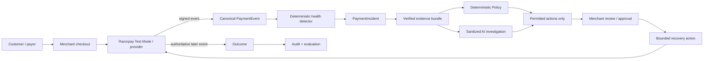

<div align="center">

# ReRoute Sentinel

### AI payment-incident response for revenue recovery

**Detect degradation. Diagnose the cause. Constrain the response. Recover safely. Prove the outcome.**

ReRoute Sentinel watches merchant payment traffic in the background, detects abnormal failure incidents, explains what changed, recommends only policy-safe recovery actions, keeps consequential execution behind human approval, and counts revenue as recovered only when provider evidence proves it.

[](https://github.com/aditya-zig/Revnue-Agent/actions/workflows/ci.yml)
[](LICENSE)


**[Try the live app](https://revnue-agent.vercel.app/) · [Judge sandbox](https://revnue-agent.vercel.app/judge) · [How it works](#how-it-works) · [Why AI](#why-ai-is-used) · [Competition](#competitive-landscape) · [Quickstart](#quickstart)**

## 10-second product intro


</div>

---

## The 30-second explanation

A merchant should not have to stare at failed-payment dashboards all day.

Payments happen normally. Sentinel watches them. If a meaningful cohort suddenly degrades—for example, UPI success falls sharply on one route—Sentinel creates a **PaymentIncident**, calculates the estimated business exposure, assembles deterministic evidence, and performs a bounded investigation **before interrupting the merchant**.

The merchant receives one actionable incident:

> **UPI payment degradation detected**  
> Normal success rate → current success rate  
> Affected payments  
> **₹X estimated revenue at risk**  
> Likely cause + confidence  
> **Recommended policy-safe response →**

From there:

```text
Payment traffic
    ↓
Deterministic incident detection
    ↓
Verified evidence bundle
    ↓
AI diagnosis / explanation
    ↓
Deterministic Policy
    ↓
AI/model ranks ONLY permitted actions
    ↓
Merchant approval
    ↓
Bounded recovery action
    ↓
Provider evidence
    ↓
Outcome: RECOVERED / FAILED / STOPPED
```

**The key idea:** AI can interpret and recommend; it cannot invent payment facts, grant itself permission, approve itself, or declare money recovered.

---

## Judge: what should I do?

Start here: **[Open the interactive judge sandbox →](https://revnue-agent.vercel.app/judge)**

The intended product journey is deliberately simple:

1. **Start interactive demo** — a clearly labelled simulated merchant day begins.
2. Watch healthy payment activity establish a baseline.
3. A planted degradation develops automatically; no manual `Refresh` should be part of the final journey.
4. Sentinel detects the incident and completes first-pass analysis in the background.
5. Click **Review incident**.
6. Compare **Verified facts** with **AI analysis — advisory**.
7. See deterministic Policy remove unsafe actions before ranking.
8. Review the recommended permitted action.
9. Approve the consequential recovery action.
10. Use Razorpay **Test Mode** for the provider-backed recovery path.
11. Sentinel marks revenue recovered only after authoritative provider evidence is persisted.
12. Open the audit/evaluation view to see exactly how the result was produced.

The UI distinguishes **SIMULATED**, **ESTIMATED**, **TEST MODE**, and **MOCK** evidence. Those words are not interchangeable.

---

## Why this product exists

Payment companies already solve large parts of the stack. That is exactly why Sentinel is **not** another payment gateway, router, dunning loop, or generic AI bot.

The problem Sentinel targets is the **incident around the transactions**:

> **Something important has started going wrong across payment traffic. Which segment is broken? How much revenue is exposed? What evidence explains it? What response is safe? Which permitted action is best? Did the intervention actually restore revenue?**

That problem becomes especially painful for high-volume merchants using multiple PSPs, payment methods, issuers and recovery paths. Provider dashboards contain useful data, but the merchant still needs one operational view that connects **detection → diagnosis → decision → recovery → proof**.

### The three objects are intentionally different

| Object | Purpose |
| --- | --- |
| `LeakFinding` | Longer-term aggregate evidence that a cohort is underperforming |
| `PaymentIncident` | A time-bounded operational degradation happening now |
| `RecoveryCase` | One failed payment/customer obligation and its recovery lifecycle |

This separation lets Sentinel reason about a population-level incident without pretending every failed payment deserves the same action.

---

## Why this is a strong fit for Razorpay Buildathon Track 03

Track 03 is **AI Revenue Recovery**: detect revenue at risk, determine the right intervention, and execute a bounded recovery workflow.

Sentinel maps directly to that brief:

- **Detect revenue at risk** → deterministic payment-health detector creates a `PaymentIncident`.
- **Determine the right intervention** → AI explains heterogeneous evidence while deterministic Policy decides what is allowed.
- **Execute a bounded workflow** → the merchant approves one exact permitted action.
- **Prove recovery** → a later Razorpay Test Mode provider event determines the Outcome.
- **Handle failure safely** → hard declines, uncertain states, duplicate webhooks, model outages and browser-dismissal cases fail closed rather than becoming fake recoveries.

The AI is meaningful, but it is deliberately kept outside the money-authority boundary.

---

## Why AI is used

A pure rules engine is excellent at facts such as:

- success-rate change;
- affected cohort;
- amount at risk;
- provider event state;
- hard-decline classification;
- contact limits;
- whether an action is allowed.

AI becomes useful **after** those facts exist. A real payment incident can combine multiple PSP vocabularies, error categories, time windows, issuer cohorts, historical outcomes and competing explanations. Sentinel uses AI to turn that evidence into a compact operational answer:

> What is the most plausible explanation? What evidence supports it? What is still uncertain? Of the actions Policy already permits, which one is most appropriate and why?

### Authority boundary

| Question | Authority |
| --- | --- |
| Did an incident objectively occur? | Deterministic detector |
| What are the observed amounts/rates/events? | Persisted provider/simulator evidence |
| What is the likely cause? | AI advisory analysis + explicit uncertainty |
| Which actions are permitted? | Deterministic Policy |
| Which permitted action ranks highest? | Recovery model / bounded AI reasoning |
| Can the action execute? | Human approval + deterministic executor |
| Was money actually recovered? | Provider-backed Outcome evidence |

If the external model is unavailable or malformed, Sentinel falls back deterministically instead of breaking payment operations.

### Data the model should never need

Sentinel does **not** need to send PAN, CVV, OTP, raw bank credentials, PSP secrets, webhook secrets or unnecessary customer PII to an LLM. The useful model input is a sanitized incident snapshot: provider, method, normalized error categories, aggregate rates, counts, amounts, time windows, permitted actions and anonymized historical outcomes.

---

## Why Razorpay might care

> **This section is a product thesis, not a claim that Razorpay has expressed acquisition or partnership intent.** Razorpay can build many of these capabilities internally.

Sentinel is strategically interesting to the Razorpay ecosystem for five reasons:

1. **It complements Optimizer instead of competing with its core job.** [Razorpay Optimizer](https://razorpay.com/docs/payments/optimizer/) chooses where an individual transaction should be routed and uses real-time payment performance to improve success rates. Sentinel starts at a different unit of work: the **incident across a population of transactions**.
2. **It is compatible with Agent Studio's direction.** [Razorpay Agent Studio](https://razorpay.com/agent-studio/) already targets AI agents for subscription recovery, abandoned carts, disputes, settlement insights and other revenue operations. Sentinel demonstrates a specialized payment-incident agent with an unusually explicit evidence/Policy/human-approval boundary.
3. **It can turn multi-PSP complexity into a Razorpay recovery opportunity.** The long-term architecture is provider-agnostic on ingestion while keeping Razorpay as a real recovery/execution surface. A merchant could detect an incident across several PSPs and still use Razorpay-hosted recovery primitives where appropriate.
4. **It makes AI decisions auditable.** For payments, “the model recommended it” is not enough. Sentinel persists facts, Policy version, permitted/blocked actions, approval and provider outcome as one trace.
5. **It focuses on merchant attention.** The merchant is interrupted only after Sentinel has something actionable to say—not for every isolated decline.

The strongest strategic framing is therefore:

> **Optimizer handles transaction routing. Sentinel handles payment-incident response: detect, diagnose, constrain, recover and prove.**

---

## Competitive landscape

**Ranking below means closeness to Sentinel's problem, not an overall company/product quality ranking.** These are mature commercial products; ReRoute Sentinel is a hackathon prototype.

| Competitive overlap | Product | What it already does well | Where Sentinel is differentiated for this use case | Where the existing product is stronger |
| ---: | --- | --- | --- | --- |
| **1 — Closest** | [Primer Observability + Workflows](https://primer.io/blog/observability-launch) | Multi-processor visibility, anomaly detection, alerts, routing/workflows, payment normalization; Primer also describes AI guidance over unified payment data | Sentinel makes the **incident object** and its closed-loop chain explicit: deterministic incident → evidence → AI hypothesis → Policy → human approval → recovery → provider Outcome | Primer is production-grade, has a broad processor ecosystem, mature orchestration, routing, analytics and workflow tooling |
| **2** | [Juspay Payment Observability / Orchestration](https://juspay.io/blog/what-is-payment-observability-solving-silent-failures-for-multi-psp-merchants) | Cross-PSP payment traces, normalized failure semantics, segmented failure detection, safe-next-action thinking and orchestration at very large scale | Sentinel deliberately exposes Policy-before-ranking, human approval and recovery proof as the central merchant workflow | Juspay is vastly stronger in scale, connector coverage, orchestration depth and production maturity |
| **3** | [Razorpay Optimizer](https://razorpay.com/docs/payments/optimizer/) | Multi-gateway routing, smart routing, real-time optimization, success-rate improvement and unified payment/refund/settlement visibility | Sentinel works at the **incident level**, quantifies affected revenue, separates verified facts from AI hypothesis, coordinates recovery cases and proves outcomes | Optimizer is far better at real transaction routing, provider connectivity and live payment optimization |
| **4** | [Razorpay Agent Studio](https://razorpay.com/agent-studio/) | Broad payment/revenue agents including subscription recovery, abandoned-cart conversion, disputes and operational agents | Sentinel is narrower and more inspectable: payment incidents, evidence provenance, deterministic Policy before ranking, human approval and provider-backed outcome | Agent Studio has broader native Razorpay integration and a much wider automation surface |
| **5** | [Stripe Revenue Recovery](https://docs.stripe.com/billing/revenue-recovery) | Mature recurring-revenue recovery: Smart Retries, emails, automatic card updates, recovery analytics and automations | Sentinel is aimed at **cross-payment incident response**, not only recurring invoice/subscription recovery | Stripe is much stronger for production subscription billing, recurring recovery and automatic collection |

### So is Sentinel “better”?

Not as a complete payments platform. Primer, Juspay, Razorpay and Stripe are mature production systems.

Sentinel is better only in the **narrow story it is designed to prove**:

> **one auditable incident-control loop that connects population-level degradation to safe recovery and provider-proven outcome, while keeping deterministic facts and money authority outside the LLM.**

That narrowness is intentional.

---

## How it works



### Provider rule

```text
Providers tell Sentinel what happened.
Deterministic code establishes facts.
AI explains patterns.
Policy determines what is allowed.
AI/model ranks only allowed actions.
Humans authorize consequential side effects.
Provider evidence proves the outcome.
```

A browser callback, modal dismissal or “payment link created” message is **not** sufficient proof that money was recovered.

---

## What is real, simulated, estimated or mock?

| Label | Meaning |
| --- | --- |
| **RAZORPAY TEST MODE** | Genuine Razorpay Test Mode API/payment activity; no real money moves |
| **SIMULATED DEMO DATA** | Deterministic merchant-day payment history and planted incidents |
| **SIMULATED PROVIDER / RAIL TELEMETRY** | Explicitly synthetic signals used where a normal merchant has no direct bank/NPCI feed |
| **ESTIMATED** | Revenue-at-risk / recoverability calculations, not booked recovered revenue |
| **MOCK** | Customer communication or operational side effect that was not genuinely delivered by a provider |
| **PROVIDER-BACKED OUTCOME** | A later verified provider event persisted as the source of the recovery result |

Direct NPCI, issuing-bank or card-network access is **not** claimed. The hackathon architecture is merchant → PSP/provider APIs → Sentinel.

---

## Current implementation

The repository is a controlled evolution of the original ReRoute recovery prototype, not a rewrite.

Already present in the codebase:

- Python 3.12 + FastAPI;
- SQLAlchemy + Alembic;
- Razorpay Test Mode order/checkout/webhook tooling;
- raw-body webhook signature verification and idempotent ingestion;
- deterministic merchant-day replay;
- provider/provenance-aware normalized payment events;
- deterministic rolling/cohort incident detection;
- `PaymentIncident` lifecycle and affected event/case linking;
- estimated revenue-at-risk calculations;
- deterministic Policy;
- recovery ranking primitives;
- human approval and bounded action primitives;
- Outcome and audit models;
- sanitized advisory OpenRouter boundary + deterministic fallback;
- reproducible evaluation and CI/browser verification tooling.

The active integration work is connecting those pieces into the final Sentinel journey:

```text
INCIDENT
  → background investigation
  → incident-level Policy/recommendation
  → merchant notification
  → approval
  → bounded recovery
  → provider-backed Outcome
  → operator-console UI
```

---

## Safety boundaries

Sentinel is deliberately constrained:

- **Razorpay Test Mode only** for payment execution in this prototype;
- raw webhook body is verified before parsing authority;
- duplicate provider events are idempotent;
- CheckoutOrder amount/currency/correlation remains deterministic;
- browser callbacks are presentation-only;
- timeout/unknown does not automatically become failed;
- hard declines cannot be restored to retry by AI ranking;
- opt-out, quiet hours and contact limits remain Policy concerns;
- AI receives sanitized evidence and no payment credentials;
- human approval is required before consequential customer-facing recovery;
- approvals can be invalidated if the policy/context changes;
- a recovery action is not a recovered Outcome;
- provider evidence is required before money is counted as recovered;
- `SIMULATED`, `ESTIMATED`, `TEST MODE` and `MOCK` are kept distinct.

---

## Where Sentinel may *not* be the right product

This is intentionally included because the idea has real limits.

Sentinel is probably a weak fit when:

- a small merchant has low payment volume and one PSP; the provider's native dashboard/recovery features may be enough;
- the merchant already runs a mature orchestration/control plane such as Primer/Juspay plus a dedicated payment-operations team;
- failure volume is too low for incident-level segmentation to be statistically useful;
- the provider does not expose enough evidence to distinguish issuer, PSP, merchant-configuration and customer causes confidently;
- the merchant expects a fully autonomous router—Sentinel intentionally keeps some consequential actions behind Policy/human control;
- a buyer wants a production-ready PCI/compliance/multi-tenant platform today; this repository is a hackathon prototype;
- the business problem is mainly recurring subscription dunning, where native Stripe/Razorpay/Chargebee-style recovery may already be a better fit.

### The biggest strategic risk

The category is not empty. Primer, Juspay, Razorpay and other payment infrastructure companies can move toward the same closed-loop incident-response workflow. Sentinel's defensibility would have to come from **cross-provider evidence quality, incident diagnosis, governance, merchant workflow, evaluation data and integration depth**—not from simply adding an LLM.

---

## Evaluation

Sentinel should be judged on measurable behavior, not on how convincing the AI prose sounds.

The repository includes reproducible synthetic evaluation for payment/recovery behavior and a deterministic detector evaluation endpoint.

Important metrics include:

- stable-traffic false-positive rate;
- incident detection delay;
- affected-cohort precision/recall against planted ground truth;
- estimated financial impact accuracy;
- recovery amount / rate in the simulated benchmark;
- unnecessary actions;
- Policy violations;
- actions per recovered case;
- time to recovery;
- model fallback rate / malformed-output handling.

Evaluation results are labelled **SIMULATED EVALUATION** and do not claim production merchant lift.

---

## Quickstart

### Requirements

- Python 3.12+
- [`uv`](https://docs.astral.sh/uv/)
- Razorpay **Test Mode** credentials for genuine provider flows
- OpenRouter key only if external advisory analysis is desired

```bash
git clone https://github.com/aditya-zig/Revnue-Agent.git
cd Revnue-Agent
uv sync --dev

# Full repository verification
make verify

# Browser checks
make browser-check

# Start the demo with Razorpay Test Mode credentials
make demo-start-with-credentials \
  CREDENTIALS=/path/to/razorpay-test-credentials.csv
```

Later runs:

```bash
make demo-start
make demo-status
make demo-open
```

Local URLs:

- Operator console — `http://127.0.0.1:8000/`
- Judge sandbox — `http://127.0.0.1:8000/judge`
- Storefront — `http://127.0.0.1:8000/storefront`
- Health — `http://127.0.0.1:8000/health`

Provider-specific setup and genuine Test Mode webhook proof are documented in [`docs/razorpay-tooling.md`](docs/razorpay-tooling.md) and [`docs/demo.md`](docs/demo.md).

---

## Project structure

```text
app/
  api/                 FastAPI routes, replay, incidents, recovery and webhooks
  db/                  SQLAlchemy persistence + incident/replay state
  domain/              payment / incident / case domain contracts
  incidents/           replay, detector and incident evaluation
  policy/              deterministic permission gate
  recovery/            ranking, controller and bounded actions
  integrations/        provider adapters, currently Razorpay-focused
  static/ + templates/ operator console, judge sandbox and storefront

simulator/              deterministic merchant-day corpus
scripts/                demo, provider, webhook and evidence tooling
tests/                  unit, integration and browser verification
docs/                   architecture, safety, evaluation and implementation plans
```

---

## Documentation

Start with these if you want the full reasoning behind the product:

- [ReRoute Sentinel implementation programme](docs/plans/reroute-sentinel-implementation-programme.md)
- [Integration & multi-session implementation plan](docs/plans/reroute-sentinel-integration-multisession-plan.md)
- [Architecture](docs/architecture.md)
- [Five-minute demo](docs/demo.md)
- [Evaluation](docs/evaluation.md)
- [Model limits](docs/model-limits.md)
- [Threat model](docs/threat-model.md)
- [Razorpay tooling](docs/razorpay-tooling.md)
- [Submission checklist](docs/submission-checklist.md)

---

## Limitations / disclaimer

ReRoute Sentinel is a **Razorpay Buildathon prototype**, not a claim of production readiness or proven product-market fit.

- Historical merchant traffic and incident ground truth are deterministic/synthetic.
- Evaluation is simulated and does not establish causal production lift.
- Razorpay execution is Test Mode only.
- A direct bank/NPCI/card-network data feed is not part of the prototype.
- External-model analysis is advisory and may fall back deterministically.
- Production authentication, tenant isolation, enterprise RBAC, compliance certification and operational SLAs remain future work.
- Competitor comparisons above describe the products' publicly documented positioning/capabilities and Sentinel's **narrow intended differentiation**; they are not claims that those platforms lack undisclosed/internal features.
- There is no evidence that Razorpay has expressed intent to acquire, partner with, or deploy ReRoute Sentinel. “Why Razorpay might care” is a strategic product thesis.

---

<div align="center">

### ReRoute Sentinel

**Find the incident. Recover safely. Prove the outcome.**

Built for **Razorpay AI Buildathon — Track 03: AI Revenue Recovery**  
Razorpay **Test Mode only** · Apache-2.0

</div>
