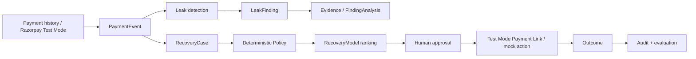

<div align="center">

# ReRoute Intelligence

### Revenue leak investigation and bounded recovery for failed Razorpay payments

ReRoute turns a failed payment into an evidence-backed RecoveryCase, constrains the available actions with deterministic Policy, ranks only permitted actions, requires human approval before customer-facing recovery, and measures the resulting Outcome.

[](https://github.com/aditya-zig/Revnue-Agent/actions/workflows/ci.yml)
[](LICENSE)


**[Live app](https://revnue-agent.vercel.app/) · [Judge playground](https://revnue-agent.vercel.app/judge) · [Quickstart](#quickstart) · [How it works](#how-it-works) · [Demo](#demo) · [Safety](#safety-boundaries) · [Docs](#documentation)**

</div>

---

## What ReRoute does

A merchant can have hundreds of failed payment attempts without knowing which failure pattern is worth fixing first or which customers are safe to contact again. ReRoute gives that workflow a deterministic spine:

1. ingest normalized payment history or a signed Razorpay Test Mode webhook;
2. detect and rank failure cohorts by estimated recoverable impact;
3. create a RecoveryCase with evidence;
4. run deterministic Policy before any ranking or side effect;
5. rank only Policy-permitted actions by expected net value;
6. require human approval for the selected recovery action;
7. execute a Test Mode Payment Link or explicit mock action;
8. persist the Outcome and full audit timeline;
9. compare the adaptive strategy with a fixed Day 0/1/3 baseline.

The demo uses **999 deterministic simulated historical attempts** followed by a separate **payment #1000** storefront journey.

### Current deterministic demo population

| Metric | Value |
| --- | ---: |
| Historical attempts | **999** |
| Captured | **749** |
| Failed | **250** |
| Failure rate | **25.03%** |
| Persisted LeakFindings | **37** |
| Storefront item | **5 kg Dumbbell** |
| Storefront amount | **₹2,499** |

`SIMULATED`, `ESTIMATED`, `MOCK`, and `TEST MODE` are deliberately separate claim classes throughout the UI and evidence pipeline.

---

## Demo

> **Screenshot placeholder 1 — Dashboard overview**  
> Tomorrow add `docs/assets/dashboard-overview.png` after starting the clean demo. Capture the 999 / 749 / 250 population, top leak, and executive metrics.

> **Screenshot placeholder 2 — Payment #1000 RecoveryCase**  
> Add `docs/assets/payment-1000-case.png`. Capture the exact case after the Test Mode failure has been correlated.

> **Screenshot placeholder 3 — Policy → ranking → approval**  
> Add `docs/assets/policy-ranking.png`. Capture permitted actions, ranked actions, the recommended action, and human approval state in one frame if possible.

> **Screenshot placeholder 4 — Razorpay storefront**  
> Add `docs/assets/storefront-checkout.png`. Capture the 5 kg Dumbbell storefront with official Razorpay Test Mode Checkout open.

### Five-minute video

> 🎥 **Video placeholder** — replace this block with the final five-minute demo link after recording. Keep the final video at or below five minutes.

Recommended recording sequence is in [`docs/demo.md`](docs/demo.md).

---

## How it works



The important invariant is:

```text
Policy decides what is allowed.
RecoveryModel ranks only what Policy already allowed.
OpenRouter can explain a finding, but it cannot authorize an action.
```

### AI is advisory, not authoritative

OpenRouter is used only for bounded `FindingAnalysis`. It receives a sanitized aggregate snapshot and may author only:

- hypotheses;
- next validation steps.

Observed facts, money values, Policy, action permission, approval, and execution stay deterministic. If OpenRouter is unavailable or malformed, ReRoute persists a deterministic fallback instead of breaking the workflow.

Run a real configured smoke check with:

```sh
make openrouter-smoke
```

A successful check reports `external_model_generated=true` and `fallback_used=false` without printing the API key.

---

## Why ReRoute instead of a fixed dunning loop?

This comparison is intentionally narrow. ✅ means the capability is explicitly demonstrated in the linked public repository/README used as prior art. ❌ means that specific capability is not demonstrated there; it is **not** a claim about every commercial feature the project may offer.

| Capability | [Hyperswitch](https://github.com/juspay/hyperswitch) | [Dunning System](https://github.com/ajithmanmu/dunning-system) | [Payment & Revenue Analytics](https://github.com/sydneyjiang000/payment-revenue-analytics) | **ReRoute** |
| --- | :---: | :---: | :---: | :---: |
| Payment-failure recovery workflow | ✅ | ✅ | ❌ | ✅ |
| Cohort-level leak quantification | ❌ | ❌ | ✅ | ✅ |
| Explicit hard-decline stop rule | ❌ | ✅ | ❌ | ✅ |
| Expected-net-value action ranking | ❌ | ❌ | ❌ | ✅ |
| Deterministic Policy before ranking | ❌ | ❌ | ❌ | ✅ |
| Human approval before recovery side effect | ❌ | ❌ | ❌ | ✅ |
| Per-case evidence + audit timeline | ❌ | ❌ | ❌ | ✅ |
| Razorpay Test Mode Checkout + Payment Link path | ❌ | ❌ | ❌ | ✅ |
| Adaptive-vs-fixed reproducible evaluation | ❌ | ❌ | ❌ | ✅ |
| Explicit SIMULATED / ESTIMATED / TEST MODE claim separation | ❌ | ❌ | ❌ | ✅ |

ReRoute is not trying to replace a payment processor or a full dunning platform. It focuses on the investigation-to-recovery decision loop for a small merchant and makes the reasoning, safety constraints, approval, side effect, and outcome visible together.

---

## Quickstart

### Requirements

- Python 3.12+
- [`uv`](https://docs.astral.sh/uv/)
- Razorpay **Test Mode** key CSV for genuine provider order/checkout flows
- OpenRouter key only if you want external FindingAnalysis generation

### First local run

```sh
git clone https://github.com/aditya-zig/Revnue-Agent.git
cd Revnue-Agent
uv sync --dev

make demo-start-with-credentials \
  CREDENTIALS=/path/to/razorpay-test-credentials.csv
```

The credential-file path is stored only in ignored local runtime configuration. Secret values are not committed.

### Later runs

```sh
make demo-start
make demo-status
make demo-open
```

Useful controls:

```sh
make demo-logs
make demo-restart
make demo-stop
```

Local URLs:

- Dashboard — `http://127.0.0.1:8000/`
- Storefront — `http://127.0.0.1:8000/storefront`
- Health — `http://127.0.0.1:8000/health`

There is no separate frontend process and no SQLite daemon. One FastAPI/Uvicorn process serves the dashboard, storefront, static assets, APIs, webhook receiver, Policy, RecoveryModel, mock inbox, and evaluation endpoints.

---

## Genuine Razorpay Test Mode webhook proof

Local rehearsal does **not** require a tunnel. A genuine Razorpay-delivered webhook does.

ReRoute now has one bounded tunnel helper:

```sh
make genuine-webhook-start
make genuine-webhook-status
```

`genuine-webhook-start`:

- verifies the local demo is healthy;
- starts only the ReRoute zrok public share;
- discovers the HTTPS URL;
- verifies `/health` through the public URL;
- sends an invalid webhook signature and requires a `401` fail-closed result;
- prints the exact Test Mode webhook URL, required events, local webhook-secret file, and Test Mode webhook OTP;
- does **not** claim provider delivery from local database state.

Then configure Razorpay Dashboard **Test Mode** with:

```text
URL:    https://<public-host>/api/v1/webhooks/razorpay
Events: payment.failed, payment.captured
Secret: value stored in .reroute-local/webhook-secret
OTP:    754081 when the Test Mode webhook flow asks for it
```

After a real Test Mode failure:

```sh
uv run python scripts/genuine_testmode_evidence.py \
  --require-failure \
  --write .reroute-local/evidence-after-failure.json
```

After a real Test Mode recovery:

```sh
uv run python scripts/genuine_testmode_evidence.py \
  --require-recovery \
  --write .reroute-local/evidence-after-recovery.json
```

A signed local event proves ReRoute accepted valid HMAC evidence. A **genuine provider-delivered** claim additionally requires observing the delivery in Razorpay Test Mode provider tooling or the Razorpay Dashboard.

Stop only the ReRoute tunnel with:

```sh
make genuine-webhook-stop
```

---

## Safety boundaries

ReRoute is deliberately constrained for a hackathon demo:

- Razorpay **Test Mode only**. Live-mode key IDs are rejected.
- raw webhook body is verified before parsing;
- duplicate provider events are idempotent;
- conflicting duplicate signed bodies are rejected;
- CheckoutOrder ownership, amount, and currency are validated;
- browser callbacks are presentation-only and never authoritative payment evidence;
- hard declines remove retry before ranking;
- customer-directed actions obey Policy, contact limits, quiet hours, opt-out and exception state;
- RecoveryModel cannot restore an action blocked by Policy;
- human approval is required before the recovery side effect;
- OpenRouter has no payment tools and cannot alter Policy;
- all Test Mode, simulated, estimated and mock claims remain visibly separated.

---

## Evaluation

The repository includes a reproducible synthetic comparison between:

- fixed Day 0/1/3 baseline;
- deterministic rules;
- adaptive action ranking.

The evaluation is labelled **SIMULATED**. It is an offline policy comparison, not a claim of production merchant lift.

Run:

```sh
curl http://127.0.0.1:8000/api/v1/evaluations/reproducible
```

See [`docs/evaluation.md`](docs/evaluation.md) for methodology and claim limits.

---

## Project structure

```text
app/
  api/                 FastAPI routes and webhook intake
  db/                  SQLAlchemy persistence
  policy/              deterministic permission gate
  recovery/            ranking, controller and action execution
  integrations/        Razorpay Test Mode adapter
  static/ + templates/ dashboard and storefront

simulator/              deterministic seeded payment corpus
scripts/                demo, provider, webhook and evidence tooling
tests/                  unit/integration/browser verification
docs/                   architecture, demo, safety and evaluation notes
```

---

## Limitations

This repository is a hackathon prototype, not a production revenue-operations platform.

- Historical merchant data is synthetic and deterministic.
- Evaluation outcomes are simulated and do not establish causal production lift.
- Razorpay integration is Test Mode only.
- Mock inbox actions are not real WhatsApp delivery.
- OpenRouter analysis is advisory and may fall back deterministically.
- There is no production authentication or multi-tenant authorization layer.
- SQLite is chosen for reproducible local demonstration, not horizontal scaling.
- Recovery probabilities are a bounded demo baseline, not a continuously trained production model.
- Genuine webhook provenance requires separate Razorpay Dashboard/provider evidence; local signed persistence alone is insufficient.

---

## Verification

```sh
make verify
make browser-check
```

Provider diagnostics:

```sh
make genuine-probe CREDENTIALS=/path/to/razorpay-test-credentials.csv
make genuine-evidence
make genuine-webhook-status
make openrouter-smoke
```

---

## Documentation

- [Architecture](docs/architecture.md)
- [Five-minute demo](docs/demo.md)
- [Runtime map](docs/runtime.md)
- [Evaluation](docs/evaluation.md)
- [Model limits](docs/model-limits.md)
- [Threat model](docs/threat-model.md)
- [Razorpay tooling](docs/razorpay-tooling.md)
- [Prior art](docs/prior-art.md)
- [Submission checklist](docs/submission-checklist.md)

---

## README design references

The presentation structure here borrows common README patterns rather than project text: short value proposition and quickstart near the top, visual demo space, capability bullets/tables, architecture, explicit limitations, documentation links, badges, and a clean license/footer. Repositories reviewed include OpenAI Codex, Claude Code, Browser Use, Supabase, n8n, Open WebUI, Ollama, LangChain, Star History, and RustDesk.

---

## Star history

<a href="https://www.star-history.com/#aditya-zig/Revnue-Agent&Date">
  
</a>

---

## License

Licensed under the [Apache License 2.0](LICENSE).

<div align="center">

Built for the Razorpay AI Buildathon. Test Mode only.

</div>
